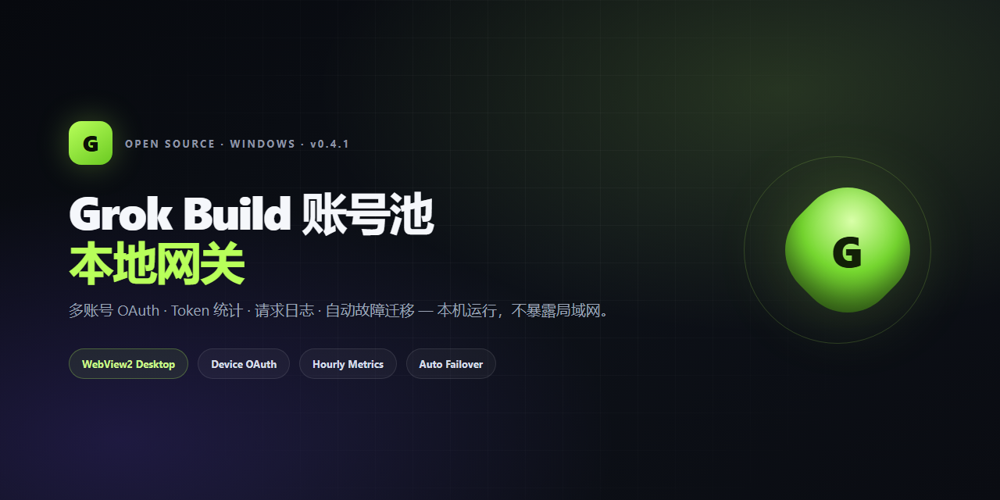
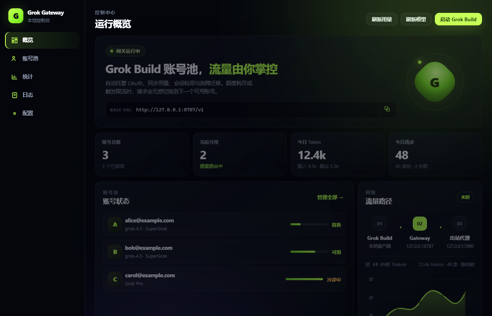
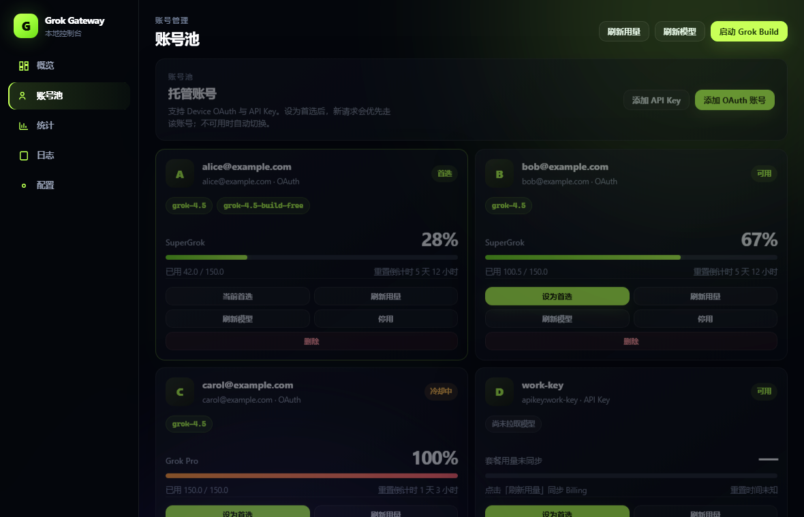
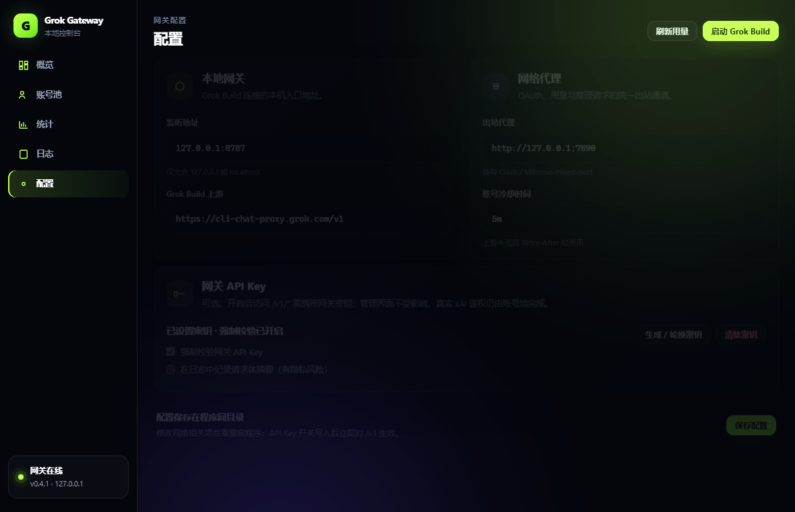

<p align="center">
  
</p>

<p align="center">
  <strong>本地 Grok Build 账号池网关</strong><br>
  多账号 OAuth · Token 统计 · 请求日志 · 自动故障迁移
</p>

<p align="center">
  <a href="https://github.com/Kazi6de1b/Grok-Gateway/releases"></a>
  <a href="https://github.com/Kazi6de1b/Grok-Gateway/stargazers"></a>
  <a href="LICENSE"></a>
  <a href="#快速开始"></a>
  <a href="go.mod"></a>
</p>

<p align="center">
  <a href="#快速开始">快速开始</a> ·
  <a href="#功能亮点">功能</a> ·
  <a href="#工作原理">原理</a> ·
  <a href="#命令行">CLI</a> ·
  <a href="#构建">构建</a> ·
  <a href="#安全">安全</a>
</p>

---

## 这是什么？

**Grok Gateway** 是跑在本机上的 Grok Build **原生协议**账号池网关：

- 用桌面控制台托管多个 Grok Build OAuth / API Key 账号
- 自动刷新 Token、同步 Billing 用量
- 额度耗尽 / `429` / 冷却时 **无感换号**
- 本地计量真实 Token（输入 / 输出 / 缓存）与请求日志
- 一键把 Grok Build 接到 `http://127.0.0.1:8787/v1`

> 它 **不是** OpenAI / Anthropic 兼容中转。只透传 Grok Build 原生 `/v1/*`（含 SSE）。

---

## 界面预览

### 运行概览

<p align="center">
  
</p>

仪表盘：在线状态、可用账号、今日 Token / 请求，以及近 48 小时分时曲线。

### 账号池

<p align="center">
  
</p>

竖向卡片多列布局 · Device OAuth / API Key · 模型标签 · 用量与冷却。

### 配置

<p align="center">
  
</p>

监听地址、上游、出站代理、冷却时间，以及可选网关 API Key。

---

## 功能亮点

| | 能力 | 说明 |
|:--:|:--|:--|
| 🖥 | **单文件桌面 GUI** | WebView2 原生窗口，不弹浏览器、不弹控制台 |
| 🔐 | **Device OAuth** | 界面内完成 xAI 授权，Token 只落本机 `config.json` |
| 🔑 | **可选网关 API Key** | 保护 `/v1/*`；支持 OAuth 与 API Key 账号入池 |
| 🧩 | **多账号池** | 启用 / 停用 / 删除 / 首选账号一键切换 |
| 📦 | **每账号模型列表** | 拉取 `/v1/models` 并缓存展示 |
| 📊 | **Billing 用量** | 套餐、百分比、重置倒计时 |
| 📈 | **本地 Token 计量** | 解析 input / output / cached tokens，近 48h 曲线 + 7 日统计 |
| ≡ | **请求日志** | 账号、模型、状态、耗时、错误码 |
| ♻️ | **Token 自动刷新** | 到期前静默刷新，单账号互斥 |
| 🧲 | **会话粘滞** | 正常情况同一会话钉死同一账号 |
| 🚑 | **自动故障迁移** | `401` 刷新失败、`429`、额度 100% → 换号重试 |
| 🌊 | **SSE 透明转发** | JSON / 流式响应原样透传 |
| 🌐 | **强制出站代理** | OAuth / 推理 / Billing 统一走本地代理 |
| 🔒 | **仅本机监听** | 强制 `127.0.0.1`，不暴露局域网 |

---

## 工作原理

```text
┌─────────────┐     ┌──────────────────────┐     ┌─────────────┐     ┌─────────────────────┐
│ Grok Build  │────▶│  Grok Gateway :8787  │────▶│ 本地代理     │────▶│ cli-chat-proxy.grok │
│  本地客户端  │     │  账号池 / 粘滞 / 迁移 │     │ :7890       │     │        .com/v1      │
└─────────────┘     └──────────▲───────────┘     └─────────────┘     └─────────────────────┘
                               │
                    ┌──────────┴───────────┐
                    │  WebView2 控制台      │
                    │  OAuth · 统计 · 日志  │
                    └──────────────────────┘
```

**选号顺序**

1. 仍可用的会话绑定  
2. 首选账号  
3. 会话键哈希  
4. 无会话时轮询  

**故障迁移**

| 上游 | 动作 |
|:--|:--|
| `401` | 强制刷新 Token，失败则冷却并换号 |
| `429` | 读 `Retry-After` 冷却，清会话绑定，换号重试 |
| 用量 100% | 冷却到重置时间 |
| 全部不可用 | 返回本地 `429` |

---

## 快速开始

### 准备条件

| 依赖 | 说明 |
|:--|:--|
| **Windows 10/11** | 桌面 GUI 需要 WebView2（通常已预装） |
| **Grok Build** | `grok --version` 有输出 |
| **本地 HTTP 代理** | 默认 `http://127.0.0.1:7890`（Clash / Mihomo mixed-port） |
| **合法账号** | 仅用于你本人拥有的 Grok Build 账号 |

> ⚠️ 出站代理是**硬性依赖**。代理未启动时，OAuth 与上游请求会失败。

### 1. 下载

到 [Releases](https://github.com/Kazi6de1b/Grok-Gateway/releases) 下载：

```text
Grok-Gateway-v0.4.1-windows-amd64.zip
```

解压得到 `GrokGateway.exe`。

### 2. 启动

双击 `GrokGateway.exe`。

- 同目录生成 `config.json`
- 监听 `http://127.0.0.1:8787`
- 打开暗色桌面控制台（默认约 1020×700，页面缩放 92%）

### 3. 添加账号

1. **账号池** → **添加 OAuth 账号**（或 API Key）  
2. 浏览器完成 xAI Device OAuth  
3. **刷新用量** / **刷新模型**  
4. 右上角 **启动 Grok Build**

启动时会在新终端临时设置：

```powershell
$env:GROK_CLI_CHAT_PROXY_BASE_URL = "http://127.0.0.1:8787/v1"
```

**不会**改写 `~/.grok/config.toml`。

### 手动接入（可选）

```powershell
$env:GROK_CLI_CHAT_PROXY_BASE_URL = "http://127.0.0.1:8787/v1"
grok
```

**API Key：** Grok Build 原生路径通常**不需要**填写 xAI API Key。  
若开启了「强制校验网关 API Key」，第三方客户端需带：

```text
Authorization: Bearer <网关密钥>
# 或
x-api-key: <网关密钥>
```

真实上游鉴权仍由账号池完成。

**模型提示：** 免费 Build 档请用 `/v1/responses` + 账号可用模型（常见 `grok-4.5`）。

---

## 命令行

```powershell
.\GrokGateway.exe             # 桌面 GUI + 本地网关
.\GrokGateway.exe serve       # 仅网关（无界面）
.\GrokGateway.exe login       # 终端 Device OAuth
.\GrokGateway.exe accounts    # 列出账号
.\GrokGateway.exe version
.\GrokGateway.exe help
```

指定配置：

```powershell
.\GrokGateway.exe --config D:\private\grok-gateway.json
# 或
$env:GROK_GATEWAY_CONFIG = "D:\private\grok-gateway.json"
```

---

## 配置

默认 `config.json`（见 [`config.example.json`](config.example.json)）：

```json
{
  "listen": "127.0.0.1:8787",
  "upstream_base_url": "https://cli-chat-proxy.grok.com/v1",
  "outbound_proxy": "http://127.0.0.1:7890",
  "cooldown": "5m",
  "require_api_key": false,
  "gateway_api_key": "",
  "log_request_bodies": false,
  "accounts": []
}
```

网络相关修改后需重启 EXE；网关 API Key 开关写入后立即对 `/v1` 生效。

---

## 构建

```powershell
go test ./...
go vet ./...
.\scripts\build.ps1 -Version 0.4.1
```

产物：`dist\GrokGateway.exe`

观测数据默认落在 EXE 同目录 `data/requests.jsonl`（请求摘要与日/小时聚合，**不含** OAuth Token）。

架构细节：[docs/DEVELOPMENT.md](docs/DEVELOPMENT.md)

---

## 项目结构

```text
cmd/grok-gateway/     入口 · 桌面宿主 · Windows 资源
internal/account/     OAuth · 账号池 · 用量 · 模型
internal/admin/       管理 API · 内嵌控制台
internal/config/      配置加载与持久化
internal/observe/     请求日志 · Token 日/小时聚合
internal/proxy/       原生 HTTP / SSE 代理
docs/assets/          README 截图与横幅
scripts/              发布构建
```

---

## 安全

- `config.json` 含 access / refresh token —— **禁止**上传、分享、提交 Git  
- 管理 API **永不**返回 OAuth Token 与网关密钥明文（生成时仅显示一次）  
- 网关强制绑定本机回环地址  
- 仅面向本人合法账号；请勿用于规避服务条款或对外提供服务  

Release 包 **不包含** 任何账号凭据。

---

## 致谢

- OAuth 常量与请求行为参考 [chenyme/grok2api](https://github.com/chenyme/grok2api)（MIT）  
- 桌面宿主 [Wails](https://github.com/wailsapp/wails)（MIT）  

详见 [THIRD_PARTY_NOTICES.md](THIRD_PARTY_NOTICES.md)

---

## License

[MIT](LICENSE) © 2026 Kazi6de1b

---

<p align="center">
  如果这个项目帮到你，请点一颗 ⭐ Star —— 这是开源最大的动力。
</p>
